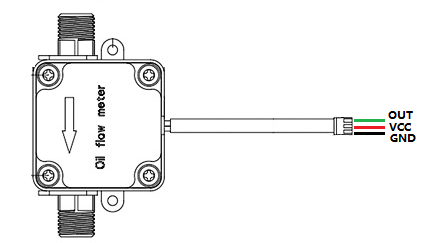

## Gravity: G3/4” Water Flow Sensor (SKU SEN0551)

Website: [Gravity: G3/4” Water Flow Sensor](https://wiki.dfrobot.com/SKU_SEN0551_Gravity_Water_Flow_Sensor_G3_4)

## Pin Connections (Sensor → ESP32)

- VCC (Red wire) → 3.3V / 5V ?
- GND (Black wire) → GND  
- OUT (Green wire) → D11 (GPIO 27) (any digital pin)

opomba: senzor še ni bil preizkušen z dejansko vodo, pa tudi pin na 27 bi mogel biti povezan z delilnikom/uporom, da se napetost zmanjša na 3.3V,
da se ne skuri (ni važna točnost voltaže, ker senzor šteje le pulze), lahko pa raje vežemo input na 3.3V, če dela normalno

